# 🛡️ Guardian: AI-Verified Accident Detection & Response System

> **"False Alarms Kill Trust. We Kill False Alarms."**
>
> Guardian is a next-gen safety application that combines **low-power native sensors** with **on-device AI** to distinguish real crashes from phone drops. It acts as an intelligent gatekeeper—verifying incidents before disturbing emergency services.

---

## 🌟 The Innovation: "Hybrid Gatekeeper" Architecture


Most crash detection apps drain battery or trigger on every phone drop. Guardian solves this by splitting detection into two phases: **The Trigger** and **The Judge**.

### 1. The Trigger (Low-Power Sentinel) 🔋
* **Technology:** Native Android Service (Kotlin).
* **Function:** Runs silently in the background using minimal battery. It monitors the accelerometer and gyroscope for sudden spikes (>2.5G) or violent rotations.
* **Role:** It is the "Watchdog" that only wakes up the app when absolutely necessary.

### 2. The Judge (AI Verification) 🧠
* **Technology:** Flutter + TensorFlow Lite + Firebase + GenAI.
* **Function:** Once woken up, the app records **10 seconds of ambient audio** and fuses it with sensor data.
    * **On-Device AI (YAMNet):** Instantly scans audio for "Glass Breaking", "Thuds", or "Screaming".
    * **Cloud GenAI (Pollinations):** Analyzes the context to make the final decision.
* **Role:** It acts as the "Judge" to rule out false alarms (e.g., phone dropping on a gym floor vs. a car crash).

---

## 🚀 Key Features

* **⚡ Smart Sensor Fusion:**
    * Native background processing filters out "Freefall" events (phone drops) before they even reach the AI.
* **🚫 False Alarm Prevention (Green Screen Protocol):**
    * If the AI determines the event is safe (e.g., loud music + low impact), the screen turns **GREEN** ("False Alarm").
    * No SMS is sent, and the event is logged as "Ignored" to prevent panic.
* **🏥 Hospital Dispatch Dashboard:**
    * A dedicated tablet interface for paramedics.
    * Shows exact crash location and allows responders to **listen to the audio evidence** before dispatching.
* **📍 Instant SOS with Live Tracking:**
    * If verified as **CRITICAL**, the app sends an SMS with high-accuracy Google Maps coordinates to emergency contacts.
    * **Fail-Safe Mode:** If the AI server is unreachable, the system defaults to "Critical" to ensure safety.

---

## 📸 Screenshots

### 1️⃣ Getting Started & Setup
| **Select Role** | **Login Screen** | **Emergency Contacts** | **Home Monitoring** |
|:---:|:---:|:---:|:---:|
| 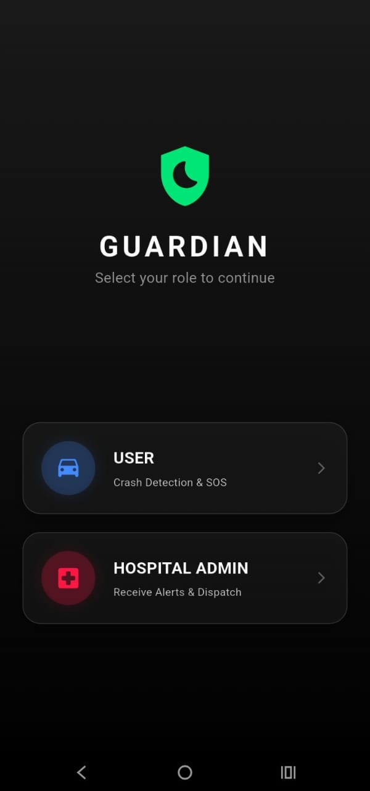 | 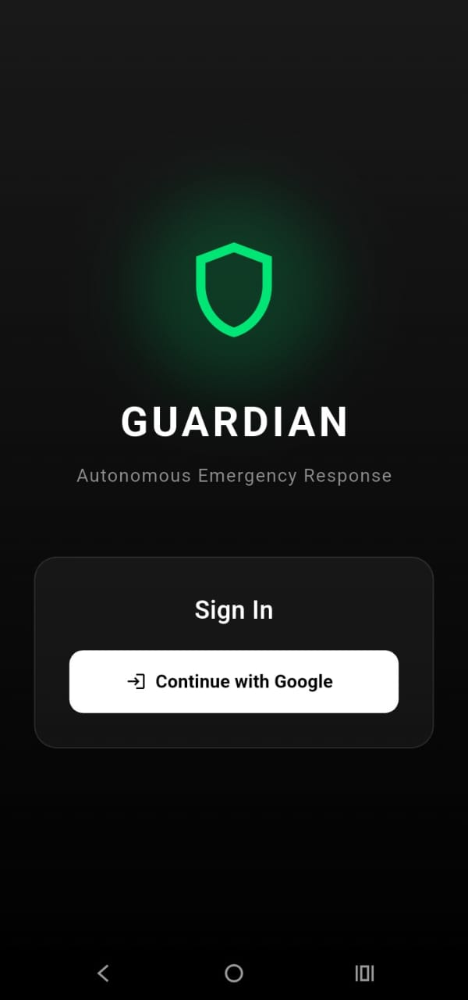 | 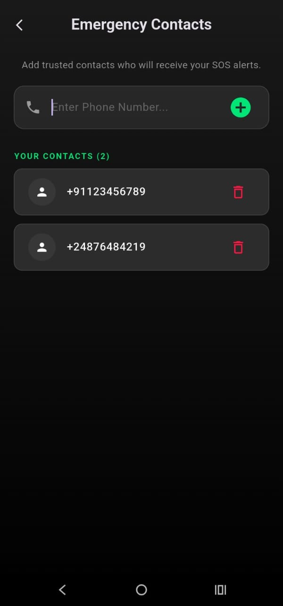 | 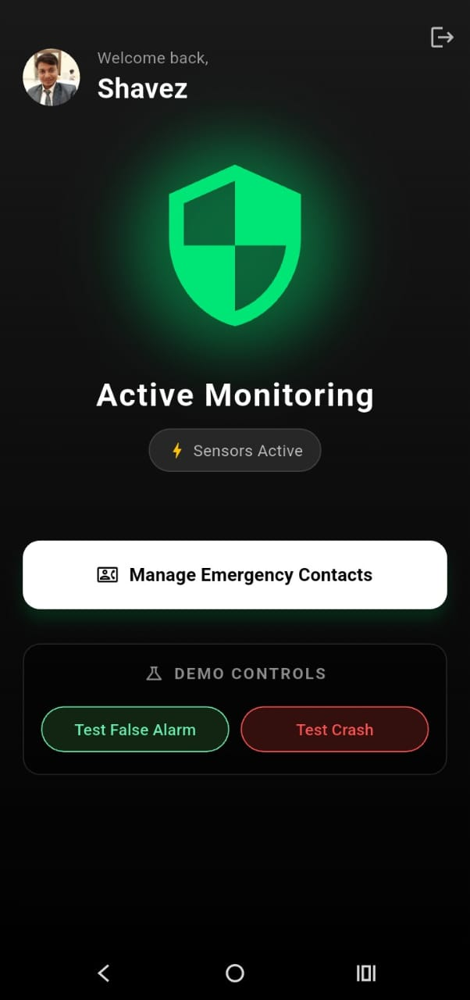 |
| *Choose User or Hospital* | *Secure Sign-In* | *Manage Trusted Contacts* | *Active Protection Mode* |

### 2️⃣ The Accident Workflow (User Side)
| **Crash Detected** | **AI Analysis** | **False Alarm** | **Connecting Hospital** | **SOS Sent** |
|:---:|:---:|:---:|:---:|:---:|
| 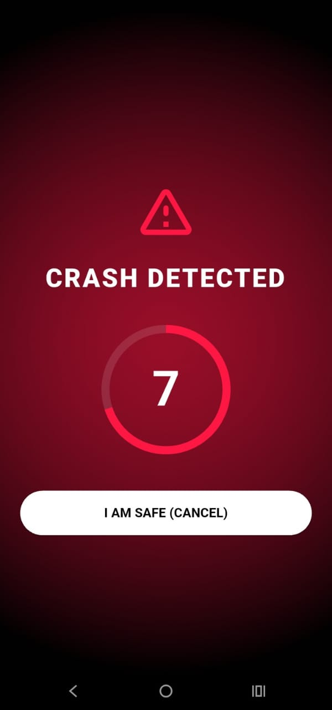 | 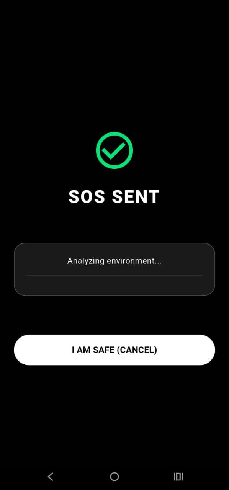 | 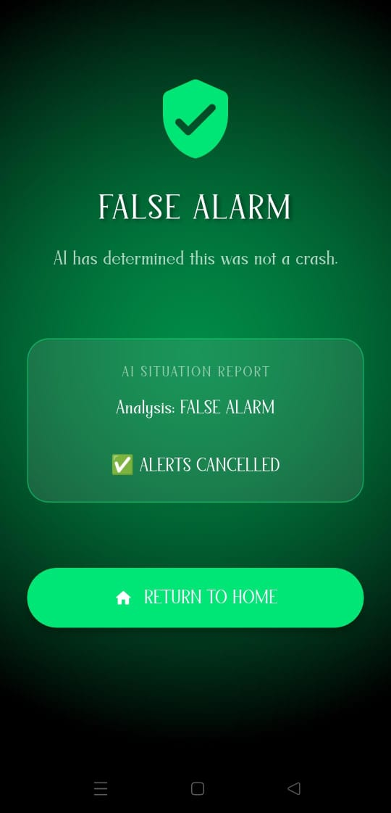 | 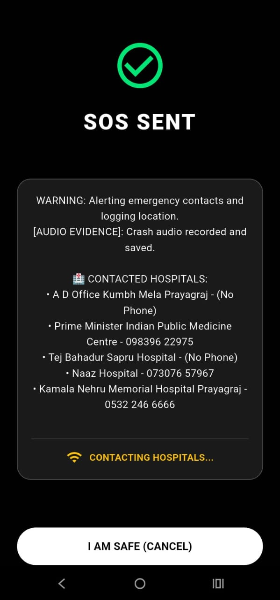 | 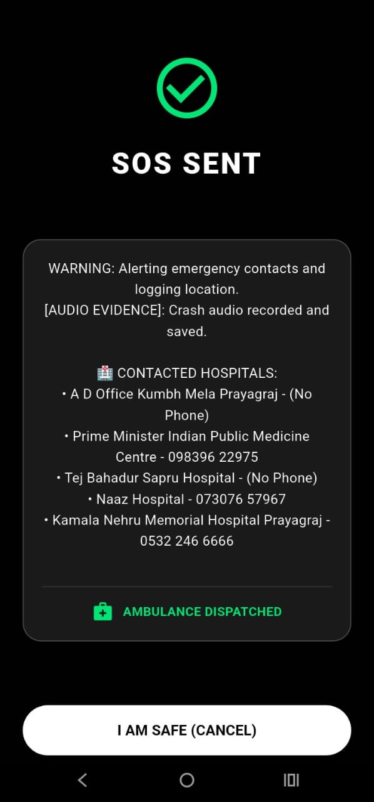 |
| *Real-time Alert Countdown* | *Processing Sensor Data* | *AI Cancels Alert* | *Finding Nearby Help* | *Alerts Dispatched* |

### 3️⃣ Hospital Response System
| **Dashboard Feed** | **Hospital Portal** | **Incident Details** | **Location View** | **Case Accepted** |
|:---:|:---:|:---:|:---:|:---:|
| 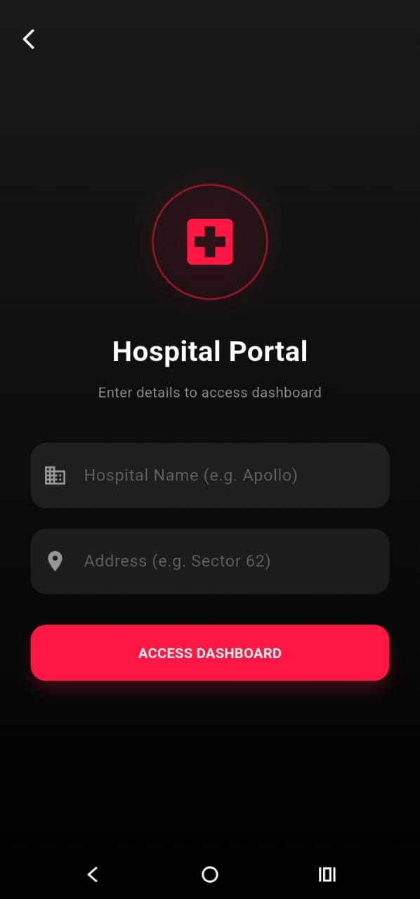 |  | 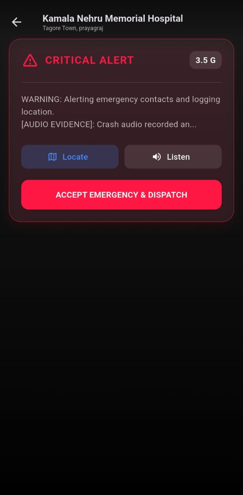 | 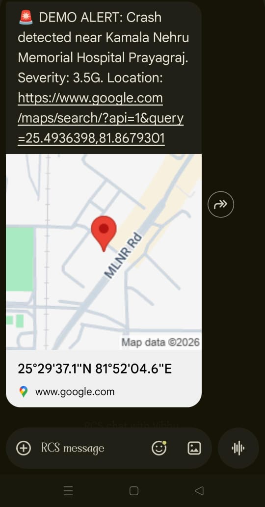 | 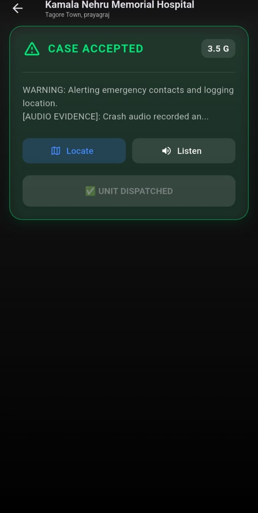 |
| *Incoming Feed* | *Admin Login* | *Severity Data* | *Map Location* | *Dispatch Confirmed* |

---

## 🛠️ Key Plugins & Tech Stack

Guardian leverages powerful open-source libraries to achieve real-time safety:

### **Core Functionality**
* **`geolocator: ^14.0.2`** – Fetches high-accuracy GPS coordinates for the SOS link.
* **`sms_sender_background: ^1.0.6`** – Sends critical SMS alerts even if the app is minimized.
* **`record: ^6.1.2`** & **`path_provider`** – Records the 10-second "Black Box" audio evidence in WAV format.
* **`audioplayers: ^6.5.1`** – Allows hospitals to playback the crash audio.

### **AI & Data**
* **`google_generative_ai: ^0.4.0`** – Powers the Cloud AI decision-making (Gemini/Pollinations integration).
* **`tflite_flutter`** – Runs the offline YAMNet audio model (on-device).
* **`firebase_core`, `auth`, `firestore`** – Handles real-time syncing between the User and Hospital Dashboard.

### **Permissions & Utilities**
* **`permission_handler: ^12.0.1`** – Manages critical access to SMS, Location, and Microphone.
* **`shared_preferences`** – Stores emergency contacts locally for offline access.
* **`url_launcher`** – Opens Google Maps for route navigation.

---

## ⚙️ Setup & Configuration (Crucial Steps)

To run this project successfully, you must complete these configuration steps:

### 1. Add Emergency Contacts 📞
The SOS feature will **NOT** work until you add contacts.
* Open the app → Login → Go to **"Manage Emergency Contacts"**.
* Add at least one phone number (e.g., your own secondary number for testing).

### 2. Configure API Keys 🔑
This app uses Google services for Maps and AI.
* **Google Maps API:** Ensure your API key is added to `android/app/src/main/AndroidManifest.xml`.
* **Gemini/Pollinations AI:** If you are using a specific API key for the AI service, ensure it is updated in `lib/services/sensor_service.dart` or `lib/services/google_places_service.dart`.

---

## 🧪 How to Demo (Hackathon Mode)

Since we cannot crash a real car on stage, the app includes a **Secret Demo Menu** on the Home Screen:

1.  **Test False Alarm (Button A):**
    * Simulates **2.2 G-Force** (Minor Bump).
    * AI Analysis: *"Low Impact + No Crash Sounds"* → **FALSE ALARM**.
    * Result: **Green Screen**, No SMS.
2.  **Test Real Crash (Button B):**
    * Simulates **8.8 G-Force** (Severe Impact).
    * AI Analysis: *"High G-Force Threshold Exceeded"* → **CRITICAL ALERT**.
    * Result: **Red Screen**, SMS Sent to contacts.

---

## 📥 Installation

1.  **Clone & Install:**
    ```bash
    git clone [https://github.com/vibhutomer/guardian.git](https://github.com/vibhutomer/guardian.git)
    cd guardian
    flutter pub get
    ```
2.  **Setup Assets:**
    * Ensure `assets/yamnet.tflite` and `assets/icon.png` are present.
3.  **Run:**
    ```bash
    flutter run
    ```

---

## 👥 Contributors

* **Vibhu Tomer** - *Flutter Developer, System Architect & Firebase Integration*
* **Sharukh Ahamad** - *Kotlin & Native Modules Developer*
* **Shavez Ali** - *Kotlin & Sensor Logic Developer*
* **Jaskaran Singh** - *AI Engineer & Model Integration*

---

## ⚠️ Disclaimer
*Guardian is a prototype safety aid. While the Hybrid Gatekeeper significantly reduces false alarms, no system is 100% perfect. Always drive responsibly.*
